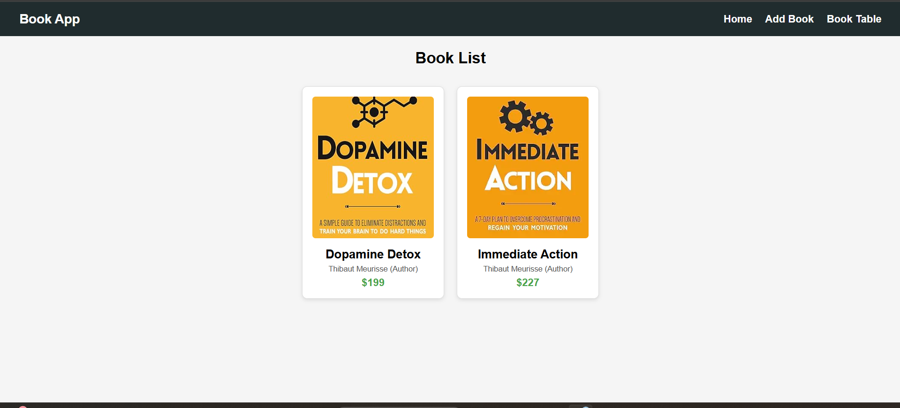
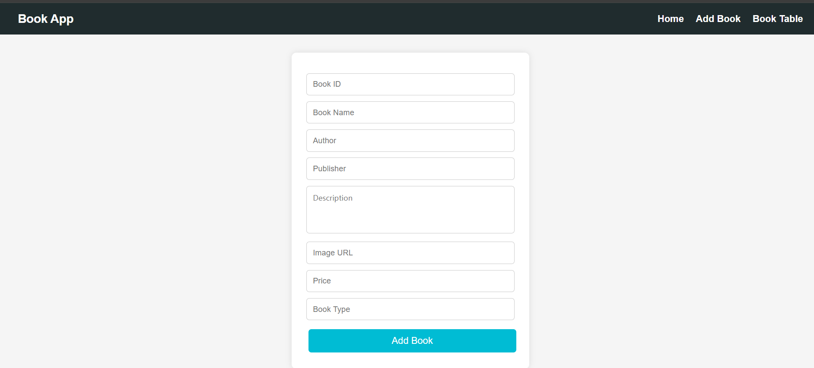
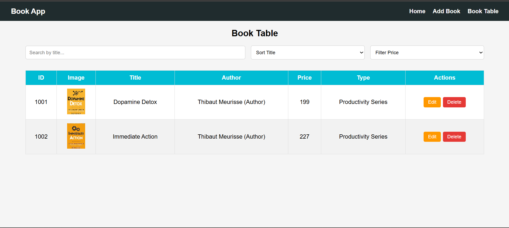

# 📚 Book Management App

## About
- Simple React CRUD application to manage books
- Users can add, view, edit, delete, search, and filter books
- Data is stored in **LocalStorage**

## Features
- Add new books
- Display books as cards
- Table view for managing books
- Edit and delete books
- Search books by title
- Sort titles (A → Z / Z → A)
- Filter books by price
- Show book images in table
- Responsive navigation bar

## Project Structure
- `src/components` – React components
- `src/utils` – LocalStorage helper
- `App.jsx` – Main application routing
- `App.css` – Styling
- `main.jsx` – Entry point

## Screenshots
- Home Page

- Add Book Form

- Table View

